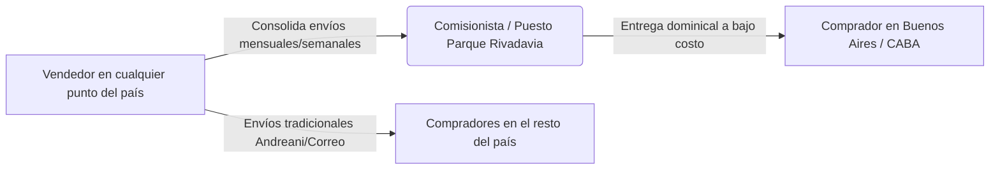
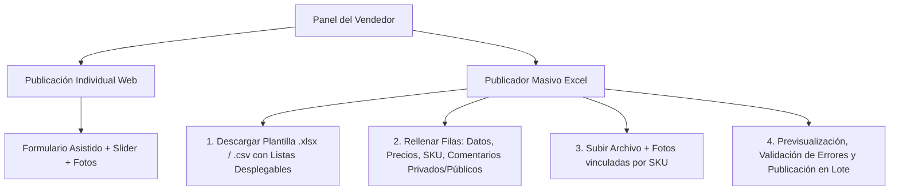

# 🪙 MERCADO DE MONEDAS - ESPECIFICACIÓN INTEGRAL Y LÓGICA DEL PROYECTO
> **Documento Maestro de Arquitectura, Flujos Operativos, Modelo de Datos y Negocio**  
> *Versión: 1.1.0 — Estado: Planificación Definitiva y Estructura Central*

---

## ÍNDICE GENERAL
1. [Visión, Filosofía y Propuesta de Valor](#1-visión-filosofía-y-propuesta-de-valor)
2. [Usuarios, Registro y Onboarding Bipolar (Nacional / Internacional)](#2-usuarios-registro-y-onboarding)
3. [Modelo de Datos de Publicación (Campos Completos)](#3-modelo-de-datos-de-publicación)
4. [Escala Oficial de Conservación y Asistente Didáctico `(?)`](#4-escala-de-conservación-y-asistente-didáctico)
5. [Lógica de Precios, Moneda Dual (ARS/USD) y DolarHoy](#5-lógica-de-precios-moneda-dual-y-dolarhoy)
6. [Modalidad de Venta: Precio Fijo vs. Negociación de Ofertas](#6-modalidad-de-venta-precio-fijo-vs-ofertas)
7. [Métodos de Publicación (Individual y Masivo vía Excel)](#7-métodos-de-publicación)
8. [Catálogo Numismático, Integración Numista y Estrategia de Caché](#8-catálogo-numismático-y-numista)
9. [Buscador Inteligente, Filtros Facetados y Comparador Multivendedor](#9-buscador-filtros-y-comparador)
10. [Logística Numismática Especializada: "Hub Parque Rivadavia" y Envíos](#10-logística-especializada-parque-rivadavia)
11. [Mecanismos Antielusión, Anonimato y Reputación Comunitaria](#11-mecanismos-antielusión-y-reputación)
12. [Filosofía de Monetización (Comisión vs. Suscripción)](#12-filosofía-de-monetización)
13. [Interfaz de Usuario (UI/UX) y Selector de Tema](#13-interfaz-de-usuario-uiux)
14. [Ecosistema Modular de Documentación Futura](#14-ecosistema-modular-de-documentación)

---

## 1. Visión, Filosofía y Propuesta de Valor

**Mercado de Monedas** nace para solucionar los problemas estructurales que sufren coleccionistas y comerciantes en plataformas generalistas (MercadoLibre, eBay, Marketplace de Facebook):

* **Comisiones desmedidas (15% al 25%)**: En monedas de bajo valor destruyen el margen y en monedas caras generan comisiones absurdas, empujando a los usuarios a negociar por fuera.
* **Falta de rigor técnico**: En plataformas tradicionales no existen filtros por Ceca, Metal, KM#, CJ#, Diámetro o Peso real.
* **Criterio de conservación difuso**: Los vendedores califican como "impecable" piezas gastadas o limpiadas.
* **Desconexión logística comunitaria**: La numismática argentina gira en torno a puntos de encuentro históricos como el **Parque Rivadavia** (CABA). Las plataformas convencionales obligan a pagar envíos caros por correo para compras pequeñas.



---

## 2. Usuarios, Registro y Onboarding

### A. Tipos de Cuenta
* **Cuenta Unificada (Comprador / Vendedor)**: Todo usuario registrado puede tanto comprar piezas como publicar sus propias monedas sin trámites burocráticos separados.

### B. Formulario de Registro y Datos de Perfil
Al registrarse por primera vez, el usuario completa:
1. **Datos Personales**: Nombre y Apellido (privados), Alias/Username público para la comunidad.
2. **Ubicación Geográfica**:
   * País (Default: *Argentina*).
   * Provincia / Estado (ej. *Buenos Aires, Salta, Santa Fe, Tierra del Fuego*).
   * Localidad / Ciudad (ej. *Mar del Plata, Salta Capital, Ushuaia, CABA*).
   * Código Postal y Dirección de entrega (privada, solo para envíos).
3. **Preferencia de Alcance de Mercado**:
   * *Pregunta de Onboarding*: `¿Qué monedas te interesa ver y comprar?`
     - `[X] Solo vendedores de Argentina (Nacional)`
     - `[ ] Vendedores de Argentina e Internacionales (Todo el mundo)`
   * *Efecto*: Aplica un filtro predeterminado en el explorador para que el usuario no vea ofertas internacionales con costos de envío complejos salvo que lo elija explícitamente.

---

## 3. Modelo de Datos de Publicación

Cada ficha de moneda contiene atributos públicos (para los compradores) y privados (para el control del vendedor):

| Campo | Tipo de Dato | Visibilidad | Propósito / Ejemplo |
| :--- | :--- | :--- | :--- |
| **Fotos** | Lista de imágenes | Pública | Mínimo 2 (Anverso y Reverso con buena luz), hasta 8 para fotos de canto o macro. |
| **Título / Denominación** | Texto | Pública | Ej: *"50 Centavos 1941"* |
| **País Emisor** | Selector / Texto | Pública | Ej: *Argentina, España, EE.UU., Chile, Perú, etc.* |
| **Año de Acuñación** | Numérico / Texto | Pública | Ej: *1941, 1881-O (año + marca de ceca si aplica)* |
| **Valor Facial** | Texto | Pública | Ej: *50 Centavos, 1 Peso, 2 Reales, 5 Francos, 1 Dólar* |
| **Composición / Metal** | Selector | Pública | *Oro, Plata (.900, .720, etc.), Cuproníquel, Cobre, Bronce, Aluminio, Bimetálica* |
| **Diámetro** | Decimal (\(mm\)) | Pública | Ej: *25.0 mm* |
| **Peso** | Decimal (\(g\)) | Pública | Ej: *6.50 g* |
| **Grado de Conservación** | Enum (PR a UNC / PROOF) | Pública | Nivel estandarizado según la escala oficial. |
| **Precio Base** | Decimal | Pública | Monto fijado por el vendedor (ej: `25000` o `25`). |
| **Moneda Base** | Enum (`ARS` / `USD`) | Pública | Divisa en la que se calculó el precio original. |
| **¿Acepta Ofertas?** | Booleano (`true`/`false`) | Pública | Switch individual por publicación. |
| **Referencia Catálogo (Externa)** | Texto | Pública | Código numismático: **KM#**, **CJ#**, Schön, Calicó, etc. |
| **Referencia Interna (SKU)** | Texto | **Privado (Vendedor)** | Código propio del vendedor para ubicar la pieza en su álbum/fichero. |
| **Comentario Público** | Texto | Pública | Ej: *"Excelente pátina de época, sin marcas de limpieza ni golpes de borde"*. |
| **Comentario Privado** | Texto | **Privado (Vendedor)** | Ej: *"Comprada en lote lote San Telmo a $8.000. Guardada en Bandeja B-12"*. |
| **Opciones de Entrega** | Flags / Configuración | Pública | Parque Rivadavia (Sí/No + Frecuencia), Correo Argentino / Andreani, Retiro Local. |

---

## 4. Escala de Conservación y Asistente Didáctico `(?)`

### A. Escala Oficial Implementada (7 Grados + Condición Especial)

```
[ PR: Mala ] ── [ G: Regular ] ── [ VG: Buena ] ── [ F: Muy Buena ] ── [ VF: Muy Fina ] ── [ XF: Excelente ] ── [ UNC: Sin Circular ]
                                                                                                        └─ [ PROOF: Prueba ]*
```

1. **PR (Poor - Mala)**: Moneda sumamente desgastada con pérdida grave de relieve. Leyendas y fechas casi ilegibles o borradas. Rayas o golpes severos. *(Ref. visual: Morgan Dollar 1901 liso)*.
2. **G (Good - Regular)**: Muy desgastada. Siluetas aplanadas pero leyendas y contornos principales identificables. *(Ref. visual: Morgan Dollar 1887 gastada)*.
3. **VG (Very Good - Buena)**: Relieves muy gastados con contornos poco definidos. Leyendas y fecha completas. Golpes leves y marcas de circulación visibles. *(Ref. visual: Morgan Dollar 1900)*.
4. **F (Fine - Muy Buena)**: Desgaste moderado pero uniforme. Relieves y leyendas claras. Los detalles más altos del diseño empiezan a distinguirse. *(Ref. visual: Morgan Dollar 1900)*.
5. **VF (Very Fine - Muy Fina)**: Ligero desgaste uniforme únicamente en los puntos más altos (cabello sobre la oreja, pecho del águila). Mantiene gran parte del brillo original. *(Ref. visual: Morgan Dollar 1903)*.
6. **XF (Extra Fine - Excelente)**: Moneda casi nueva. Circulación mínima. Puede haber perdido algo de brillo pero no tiene rayas ni golpes visibles a simple vista. *(Ref. visual: Morgan Dollar 1881)*.
7. **UNC (Uncirculated - Sin Circular / Flor de Cuño)**: Moneda nueva de ceca, jamás circuló. Conserva el 100% de su brillo original (*mint luster*) y campos intactos. Sin desgaste en puntos altos. *(Ref. visual: Morgan Dollar 1881 brillante)*.
8. **PROOF (Prueba / Fondo Espejo)**: Tipo de acuñación especial (no un grado de desgaste). Cuños pulidos, fondo espejo y figuras satinadas/mate. Se presenta encapsulada para coleccionistas. *(Ref. visual: Silver Eagle 2006 Proof)*.

### B. Interacción del Asistente Didáctico `(?)`
* Al lado de la barra deslizante de conservación se sitúa un icono `(?)`.
* **Vendedores Experimentados**: Deslizan la barra directamente en 1 segundo.
* **Vendedores Nuevos**: Al pasar el cursor sobre `(?)` (o tocar en mobile), se abre un **panel flotante interactivo** con la infografía técnica con flechas explicativas y la fotografía real correspondiente al grado seleccionado.

---

## 5. Lógica de Precios, Moneda Dual y DolarHoy

### A. Fijación de Precios en ARS o USD
* El vendedor puede publicar en **Pesos Argentinos (ARS)** o en **Dólares Estadounidenses (USD)**.
* Si el vendedor publica en USD (ej. `USD 10`), el precio en ARS se ajusta automáticamente con el tipo de cambio del día, protegiendo al vendedor contra la inflación.
* Si el vendedor publica en ARS (ej. `$15.000`), el precio se muestra en ARS y su equivalente en USD.

### B. Cotización de Referencia: Dólar Blue Venta (`dolarhoy.com`)
* **Análisis de Rendimiento y Consumo Computacional**:
  * **Consumo virtualmente nulo**: El backend ejecuta un proceso liviano programado (*Cron Job*) que realiza **1 única consulta cada 60 minutos** a `https://dolarhoy.com` para extraer la cotización de **Dólar Blue Venta**.
  * La cotización obtenida (ej. `$1.320`) se almacena en caché de servidor y base de datos con su timestamp.
  * Cuando los miles de compradores navegan la web y alternan el botón `[ ARS | USD ]` en la cabecera, la conversión se efectúa en milisegundos en el navegador del usuario (cálculo cliente), garantizando **máxima velocidad sin carga de servidor**.

---

## 6. Modalidad de Venta: Precio Fijo vs. Ofertas

* **Control Individual por Moneda**: Cada publicación cuenta con el switch `¿Acepta ofertas? (Sí / No)`.
* **Modo Solo Precio Fijo**: Solo se muestra el botón *"Comprar ahora"*.
* **Modo Acepta Ofertas**:
  * Se muestran los botones *"Comprar ahora"* y *"Hacer una oferta"*.
  * **Flujo de Negociación Ágil**:
    1. El comprador envía una oferta en monto exacto (ej. pide $18.000 por una moneda de $20.000).
    2. El vendedor recibe notificación y puede: **Aceptar**, **Contraofertar** o **Rechazar**.
    3. Límite de 3 ofertas por comprador en la misma publicación para evitar spam.
    4. La aceptación bloquea la compra al precio acordado durante 24 horas.

---

## 7. Métodos de Publicación



### A. Publicación Individual Asistida
* Carga de fotos rápida desde móvil o PC.
* Autocompletado desde la base de datos interna si la moneda ya fue catalogada antes.

### B. Publicador Masivo (Bulk Import vía Excel)
* **Plantilla descargable**: Excel preformateado con columnas validadas (País, Denominación, Año, Metal, Grado de Conservación, Precio, Moneda, Acepta Ofertas, KM/CJ, SKU, Comentario Público, Comentario Privado).
* **Vinculación de Imágenes Masivas**:
  * *Método 1*: Columna de URLs web.
  * *Método 2 (Recomendado)*: Carga de carpeta de fotos donde los archivos llevan el nombre de la **Referencia Interna (SKU)** (ej: `SKU120_1.jpg`, `SKU120_2.jpg`). El sistema vincula automáticamente las fotos con cada fila del Excel.

---

## 8. Catálogo Numismático y Numista

### A. Estrategia de Cuotas de API Numista (~2.000 req/mes)
1. **Capa Gratuita (Carga Manual Asistida)**: El vendedor completa los campos estándar sin costo.
2. **Caché Numismático Propio (Base Local)**: Toda moneda catalogada por primera vez almacena sus metadatos (KM#, tirada, metal, peso, dimensiones) en la base de datos de *Mercado de Monedas*. Las futuras publicaciones de esa misma moneda consumen los datos locales sin tocar la API de Numista.
3. **Importador Automático Numista (Servicio Pro / Valor Agregado)**: Función avanzada para auto-rellenar fichas con 1 clic consumiendo la API externa.

---

## 9. Buscador, Filtros y Comparador

### A. Buscador Inteligente (Fuzzy Search)
* No exige coincidencia exacta de texto. Si el usuario busca *"Patria 1883 50 centavos plata"*, el motor descompone los términos (País: Argentina, Época: Monedas Patrias, Año: 1883, Metal: Plata, Denominación: 50 Centavos) y devuelve los resultados correctos.

### B. Filtros Facetados Inspirados en Numista
* **País y Continente**.
* **Rango de Años / Antigüedad** (ej. Coloniales, Siglo XIX, Siglo XX, Actuales).
* **Metal / Composición** (Oro, Plata, Cuproníquel, Cobre, etc.).
* **Estado de Conservación** (Filtrar por grado mínimo, ej. *Desde VF en adelante*).
* **Rango de Precio** (En ARS o USD).
* **Modalidad**: *Acepta ofertas* / *Solo precio fijo*.
* **Logística**: *Entrega en Parque Rivadavia* (Sí / No) / *Ubicación del vendedor por provincia*.

### C. Ficha de Catálogo con Comparador Multivendedor

```
┌────────────────────────────────────────────────────────────────────────────────────────┐
│  FICHA OFICIAL: Argentina - 50 Centavos 1941 (KM# 39) - Cuproníquel - Ø 25mm - 6.5g     │
├────────────────────────────────────────────────────────────────────────────────────────┤
│  3 VENDEDORES DISPONIBLES PARA ESTA MONEDA:                                            │
│                                                                                        │
│  1. [Foto Real]  Estado: UNC (Sin Circular)   $12.000 ARS   [Comprar] [Ofertar]       │
│     Vendedor: Mar del Plata | ★★★★★ (4.9) | 🌳 Entrega en Parque Rivadavia: 1er Dom/Mes │
│                                                                                        │
│  2. [Foto Real]  Estado: VF (Muy Fina)        $6.500 ARS    [Comprar]                 │
│     Vendedor: CABA          | ★★★★★ (5.0) | 🌳 Entrega en Parque Rivadavia: Todos los Dom│
│                                                                                        │
│  3. [Foto Real]  Estado: G (Regular)          $2.500 ARS    [Comprar] [Ofertar]       │
│     Vendedor: Salta         | ★★★★☆ (4.2) | 📦 Envío por Correo Argentino / Andreani  │
└────────────────────────────────────────────────────────────────────────────────────────┘
```

---

## 10. Logística Especializada: "Hub Parque Rivadavia"

### La Realidad del Mercado Numismático Argentino
Vendedores de todo el país (ej. Mar del Plata, Rosario, Córdoba, Salta) consolidan paquetes de múltiples clientes y los envían mensualmente a un contacto/comisionista de confianza en CABA. Ese comisionista atiende el domingo en el **Parque Rivadavia** y reparte los pedidos a los coleccionistas locales a un costo mínimo o nulo.

### Integración en la Plataforma
1. **Configuración en el Perfil del Vendedor**:
   - `¿Realizas entregas en Parque Rivadavia?`: `[X] Sí  [ ] No`
   - `Frecuencia de entrega`:
     - *Todos los domingos (vendedores locales de CABA / GBA)*.
     - *Quincenal*.
     - *Mensual (ej. primer domingo de cada mes)*.
     - *Fecha puntual configurable (ej. Domingo 15 de Septiembre)*.
2. **Flujo de Retiro para el Comprador**:
   - El comprador elige *"Retiro en Parque Rivadavia"* al comprar.
   - El sistema emite un **Ticket / Código de Retiro Seguro**.
   - El domingo pactado, el comprador acude al punto de entrega en Parque Rivadavia, presenta el código y retira su moneda embalada.

---

## 11. Mecanismos Antielusión y Reputación

### A. Anonimato Pre-Venta (Protección de la Plataforma)
* Para evitar que las partes deriven la venta por privado y eludan la plataforma:
  * No se divulgan nombres y apellidos completos, números telefónicos, direcciones exactas ni enlaces externos en las publicaciones.
  * La ficha muestra: *Ubicación general (Ciudad/Provincia), Calificación en estrellas y Estadísticas de entregas*.
  * Los datos de contacto y despacho se revelan únicamente **una vez confirmada la operación en la plataforma**.

### B. Reputación y Calificación Comunitaria Obligatoria
* Al completarse la entrega, es obligatorio que el comprador valore la transacción para mantener la transparencia de la comunidad:
  * **Exactitud del Estado de Conservación**: ¿La moneda coincidía con el grado seleccionado (PR a UNC)?
  * **Embalaje Numismático**: ¿La pieza vino protegida en cartón/cápsula sin riesgo de rayaduras?
  * **Velocidad y Cumplimiento de Entrega**.

---

## 12. Filosofía de Monetización

* **Objetivo**: Cobro de una comisión pequeña por venta (ej. 3% a 6%) para que el vendedor prefiera la seguridad y visibilidad de la plataforma antes que arriesgarse por canales informales.
* **Equidad**: Las monedas económicas aportan centavos y las monedas valiosas aportan proporcionalmente más, manteniendo un esquema justo para todos los perfiles de vendedores.
* *(La integración técnica específica de pasarelas, custodia y split de pagos se detallará en el archivo complementario `PAGOS_Y_COMISIONES.md`)*.

---

## 13. Interfaz de Usuario (UI/UX)

* **Selector de Tema (Esquina superior derecha)**:
  * **Modo Claro (Por Defecto)**: Fondo blanco nítido con alto contraste.
  * **Modo Oscuro (Gris Oscuro / Antracita)**: Fondo en tonos #18181B / #121212 que destaca el brillo metálico de piezas de plata y oro.
* **Selector Bimonetario**: `[ ARS | USD ]` en la barra superior accesible en todo momento.

---

## 14. Ecosistema Modular de Documentación

* [`LOGICA_DEL_PROYECTO.md`](file:///Users/ezecarbajo/Desktop/Proyectos/MKT/LOGICA_DEL_PROYECTO.md) *(Cerebro Maestro y Arquitectura Central)*.
* `PAGOS_Y_COMISIONES.md` *(Módulo de Pasarelas, Comisiones y Split de Pagos)*.
* `CATALOGO_NUMISMATICO_Y_FOTOS.md` *(Módulo de API Numista, Visor Zoom HD y Procesamiento de Imágenes)*.
* `LOGISTICA_Y_ENVIOS.md` *(Módulo de Tickets QR Parque Rivadavia e Integración de Correos)*.
