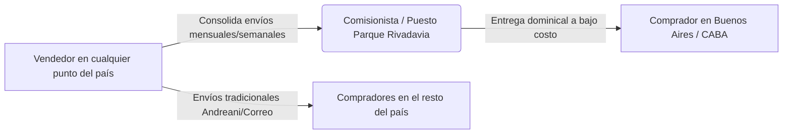

# 🪙 MERCADO DE MONEDAS - ESPECIFICACIÓN INTEGRAL Y LÓGICA DEL PROYECTO
> **Documento Maestro de Arquitectura, Flujos Operativos, Modelo de Datos y Negocio**  
> *Versión: 1.2.0 — Estado: Especificación Consolidada y Lógica Operativa*

---

## ÍNDICE GENERAL
1. [Visión, Filosofía y Propuesta de Valor](#1-visión-filosofía-y-propuesta-de-valor)
2. [Portada Cinematográfica y Navegación Institucional](#2-portada-cinematográfica-y-navegación-institucional)
3. [Usuarios, Registro y Onboarding Bipolar (Nacional / Internacional)](#3-usuarios-registro-y-onboarding)
4. [Modelo de Datos de Publicación (Campos Completos)](#4-modelo-de-datos-de-publicación)
5. [Escala Oficial de Conservación y Progresión Intermedia (+ y -)](#5-escala-oficial-de-conservación-y-progresión-intermedia--y--)
6. [Lógica de Precios, Moneda Dual (ARS/USD) y Dólar Blue](#6-lógica-de-precios-moneda-dual-arsusd-y-dólar-blue)
7. [Modalidad de Venta: Precio Fijo vs. Negociación de Ofertas](#7-modalidad-de-venta-precio-fijo-vs-negociación-de-ofertas)
8. [Métodos de Publicación y Check-list de Entrega Condicional](#8-métodos-de-publicación-y-check-list-de-entrega-condicional)
9. [Catálogo Numismático, Integración Numista y Estrategia de Caché](#9-catálogo-numismático-integración-numista-y-estrategia-de-caché)
10. [Buscador Inteligente, Filtros Facetados y Comparador Multivendedor](#10-buscador-inteligente-filtros-facetados-y-comparador-multivendedor)
11. [Logística Numismática Especializada: "Hub Parque Rivadavia" y Envíos](#11-logística-numismática-especializada-hub-parque-rivadavia-y-envíos)
12. [Mecanismos Antielusión, Anonimato y Reputación Comunitaria](#12-mecanismos-antielusión-anonimato-y-reputación-comunitaria)
13. [Filosofía de Monetización](#13-filosofía-de-monetización)
14. [Directrices de Interfaz de Usuario (UI/UX), Tipografía y Estilo Editorial](#14-directrices-de-interfaz-de-usuario-uiux-tipografía-y-estilo-editorial)
15. [Ecosistema Modular de Documentación Futura](#15-ecosistema-modular-de-documentación-futura)

---

## 1. Visión, Filosofía y Propuesta de Valor

**Mercado de Monedas** nace para solucionar los problemas estructurales que sufren coleccionistas y comerciantes en plataformas generalistas (MercadoLibre, eBay, Marketplace de Facebook):

* **Comisiones desmedidas (15% al 25%)**: En monedas de bajo valor destruyen el margen y en monedas caras generan costos absurdos, empujando a los usuarios a negociar por fuera sin garantías.
* **Falta de rigor técnico**: En plataformas tradicionales no existen filtros por Ceca, Metal, KM#, CJ#, Diámetro o Peso real.
* **Criterio de conservación difuso**: Los vendedores califican como "impecable" piezas gastadas o limpiadas.
* **Desconexión logística comunitaria**: La numismática argentina gira en torno a puntos de encuentro históricos como el **Parque Rivadavia** (CABA). Las plataformas convencionales obligan a pagar envíos caros por correo para compras pequeñas.

---

## 2. Portada Cinematográfica y Navegación Institucional

### A. Experiencia de Portada
* **Atmósfera Audiovisual**: Integración de video de fondo en loop con iluminación rasante sobre relieves de época y texturas metálicas.
* **Manifiesto de la Revolución Numismática**: Posicionamiento como el primer ecosistema federal que unifica a coleccionistas y comerciantes de todo el país con transparencia técnica y acceso libre para publicar.
* **Showcase Editorial de Piezas Históricas**: Muestra en primer plano de piezas fundacionales argentinas (*8 Reales 1813 Potosí, Patacón 1881 Oudiné, 5 Pesos Argentino Oro y 50 Centavos Libertad*).
* **Flujo hacia el Mercado**: Botón directo *"Explorar Publicaciones"* con transición y scroll fluido hacia las categorías y publicaciones activas sin rodeos ni fricción comercial.

### B. Regla Global de Navegación
* Al hacer clic sobre el logotipo o isotipo `🪙 Mercado de Monedas` en cualquier pantalla, la plataforma restablece de inmediato los filtros y búsquedas activas, retornando al inicio.

---

## 3. Usuarios, Registro y Onboarding

### A. Tipos de Cuenta
* **Cuenta Unificada (Comprador / Vendedor)**: Todo usuario registrado puede tanto comprar piezas como publicar sus propias monedas sin trámites burocráticos separados.

### B. Formulario de Registro y Datos de Perfil
Al registrarse por primera vez, el usuario completa:
1. **Datos Personales**: Nombre y Apellido (privados), Alias/Username público para la comunidad.
2. **Ubicación Geográfica**:
   * País (Default: *Argentina*).
   * Provincia / Estado (ej. *Buenos Aires, Salta, Santa Fe, Córdoba, CABA*).
   * Localidad / Ciudad.
   * Código Postal y Dirección de entrega (privada, solo para envíos).
3. **Preferencia de Alcance de Mercado**:
   * *Pregunta de Onboarding*: `¿Qué monedas te interesa ver y comprar?`
     - `[X] Solo vendedores de Argentina (Nacional)`
     - `[ ] Vendedores de Argentina e Internacionales (Todo el mundo)`
   * *Efecto*: Aplica un filtro predeterminado en el explorador para que el usuario no vea ofertas internacionales con costos de envío complejos salvo que lo elija explícitamente.

---

## 4. Modelo de Datos de Publicación

Cada ficha de moneda contiene atributos públicos (para los compradores) y privados (para el control del vendedor):

| Campo | Tipo de Dato | Visibilidad | Propósito / Ejemplo |
| :--- | :--- | :--- | :--- |
| **Fotos** | Lista de imágenes | Pública | Mínimo 2 (Anverso y Reverso con buena luz), foto de canto opcional recomendada. |
| **Título / Denominación** | Texto | Pública | Ej: *"50 Centavos 1941 Libertad"* |
| **País Emisor** | Selector / Texto | Pública | Ej: *Argentina, España, EE.UU., Chile, Perú, etc.* |
| **Año de Acuñación** | Numérico / Texto | Pública | Ej: *1941, 1881-O (año + marca de ceca si aplica)* |
| **Valor Facial** | Texto | Pública | Ej: *50 Centavos, 1 Peso, 2 Reales, 5 Francos, 1 Dólar* |
| **Composición / Metal** | Selector | Pública | *Oro, Plata (.900 / .925), Cuproníquel, Cobre, Bronce, Aluminio, Bimetálica* |
| **Diámetro** | Decimal (\(mm\)) | Pública | Ej: *25.0 mm* |
| **Peso** | Decimal (\(g\)) | Pública | Ej: *6.50 g* |
| **Grado de Conservación** | Enum con grados intermedios | Pública | Escala de 19 pasos (desde Mala hasta Proof, incluyendo `+` y `-`). |
| **Precio Base** | Decimal | Pública | Monto fijado por el vendedor (ej: `$15.000` o `USD 100`). |
| **Moneda Base** | Enum (`ARS` / `USD`) | Pública | Divisa en la que se fijó el precio original. |
| **¿Acepta Ofertas?** | Booleano (`true`/`false`) | Pública | Switch individual por publicación. |
| **Referencia Catálogo** | Texto | Pública | Código numismático: **KM#**, **CJ#**, Schön, Calicó, etc. |
| **Referencia Interna (SKU)** | Texto | **Privado (Vendedor)** | Código propio del vendedor para ubicar la pieza en su álbum o bandeja. |
| **Comentario Público** | Texto | Pública | Ej: *"Excelente pátina de época, sin marcas de limpieza ni golpes de canto"*. |
| **Comentario Privado** | Texto | **Privado (Vendedor)** | Ej: *"Comprada en San Telmo por $8.000. Bandeja B-12"*. |
| **Opciones de Entrega** | Checklist condicional | Pública | Configuración de Correo, Retiro en Mano y Parque Rivadavia con plazos. |

---

## 5. Escala Oficial de Conservación y Progresión Intermedia (+ y -)

### A. Progresión Numismática Estricta (Orden Creciente)
La plataforma implementa la escala internacional adaptada al coleccionismo hispanoamericano y argentino, contemplando los grados intermedios:

$$\text{Mala (PR)} \rightarrow \text{Regular (G)} \rightarrow \text{Regular+ (G+)} \rightarrow \text{Buena- (VG-)} \rightarrow \text{Buena (VG)} \rightarrow \text{Buena+ (VG+)} \rightarrow \text{Muy Buena- (MB-)} \rightarrow \text{Muy Buena (MB/F)} \rightarrow \mathbf{\text{MB+ (F+)}} \rightarrow \mathbf{\text{EX- (XF-)}} \rightarrow \mathbf{\text{EX (XF)}} \rightarrow \text{EX+ (XF+)} \rightarrow \text{SC- (UNC-)} \rightarrow \text{SC (UNC)} \rightarrow \text{SC+ (UNC+)} \rightarrow \text{PROOF}$$

* **Grados Intermedios (`+` y `-`)**: Permiten al vendedor y comprador calificar con exactitud piezas de transición (ej. una moneda con desgaste leve pero pátina y cuño superiores a la media califica como **MB+** o **EX-**).
* **PROOF**: Acuñación especial de colección con fondo espejo y relieve mate/satinado.

### B. Barra Deslizante Interactiva (*Grading Slider*)
* En lugar de selectores rígidos, tanto en el formulario de publicación como en la guía didáctica se utiliza una **barra deslizante continua/paso a paso**:
  * **Desktop**: Arrastre fluido manteniendo presionado el clic del mouse.
  * **Mobile / Celular**: Deslizamiento táctil con el dedo.
  * Muestra en tiempo real la nomenclatura combinada (`MB+ / F+`), descripción técnica de desgaste y foto real de referencia.

---

## 6. Lógica de Precios, Moneda Dual (ARS/USD) y Dólar Blue

### A. Visualización Predeterminada en Pesos Argentinos (ARS)
* La plataforma muestra por defecto todos los precios de forma nítida y destacada en **Pesos Argentinos** (ej. `$ 15.000`), manteniendo una equivalencia secundaria en dólares.
* El usuario puede alternar la divisa activa con el switch `[ ARS | USD ]` en la barra superior.

### B. Cotización de Referencia (Dólar Blue Venta)
* El backend consulta periódicamente la cotización de **Dólar Blue Venta** (referencia base `$1.550 ARS/USD`).
* Todas las publicaciones expresadas en dólares se convierten en tiempo real para compradores en pesos sin desactualizarse ante oscilaciones cambiarias.
* El cálculo de conversión se ejecuta en el cliente (navegador), optimizando recursos de servidor.

---

## 7. Modalidad de Venta: Precio Fijo vs. Negociación de Ofertas

* **Control Individual por Publicación**: El vendedor decide si una moneda acepta ofertas o se vende únicamente a precio fijo.
* **Flujo de Negociación Ágil**:
  1. El comprador envía una contrapropuesta económica con monto puntual.
  2. El vendedor recibe notificación y puede: **Aceptar**, **Contraofertar** o **Rechazar**.
  3. Límite estricto de **3 intentos de oferta por comprador** en una misma pieza para evitar spam.
  4. La aceptación formal genera un bloqueo de reserva por 24 horas para completar el pago.

---

## 8. Métodos de Publicación y Check-list de Entrega Condicional

### A. Check-list de Formas de Entrega al Publicar
No todos los vendedores entregan en Parque Rivadavia (especialmente quienes residen en el interior del país). Por ello, el formulario de publicación exige una check-list explícita:

1. `[X] Envío por Correo Postal (Correo Argentino / Andreani a todo el país)` *(activado por defecto)*.
2. `[ ] Retiro en mano / domicilio del vendedor` *(acuerdo directo)*.
3. `[ ] ¿Realizás entrega presencial en Parque Rivadavia (CABA)?` *(desactivado por defecto)*:
   * Al tildar **Sí**, se despliega el menú de plazos y frecuencia:
     - 🔘 **Todos los domingos** (10:00 a 14:00 hs — Vendedores habituales de CABA/GBA).
     - 🔘 **En las próximas 2 semanas** (primer domingo disponible).
     - 🔘 **En 1 mes** (primer domingo del próximo mes).
     - 🔘 **Fecha puntual específica** (con selector de calendario exacto, ej: *Domingo 20 de Septiembre*).

### B. Publicador Masivo vía Excel (Bulk Upload)
* Permite a comerciantes cargar cientos de piezas en lote mediante plantilla `.xlsx` / `.csv` estandarizada vinculando fotos por código SKU.

---

## 9. Catálogo Numismático, Integración Numista y Estrategia de Caché

* **Caché Local Propio**: Toda moneda catalogada por primera vez almacena sus metadatos (KM#, tirada, metal, peso, diámetro) en la base de datos interna. Las siguientes publicaciones reutilizan estos datos sin saturar APIs externas.
* **Normalización de Fichas**: Agrupación de publicaciones por identificador de catálogo para alimentar el comparador multivendedor.

---

## 10. Buscador Inteligente, Filtros Facetados y Comparador Multivendedor

### A. Buscador Inteligente
* Reconocimiento de términos numismáticos combinados (País, Época, Año, Metal, KM#, Denominación).

### B. Filtros Facetados
* Filtrado por País, Rango de Años, Metal, **Conservación Mínima (con estados + y -)**, Rango de Precios, Acepta Ofertas y Disponibilidad de Entrega en Parque Rivadavia.

### C. Comparador Multivendedor
* En la ficha de una moneda se listan todos los ejemplares ofrecidos por distintos vendedores, permitiendo comparar de un vistazo: fotos reales, grado exacto (**MB+**, **EX-**, **SC**), precio y opciones de entrega.

---

## 11. Logística Numismática Especializada: "Hub Parque Rivadavia" y Envíos

* **Funcionamiento**: Vendedores de todo el país pueden consolidar lotes y enviarlos a un comisionista o puesto en Parque Rivadavia para entrega dominical sin costo de envío individual para compradores de CABA/GBA.
* **Ticket de Retiro / PIN Seguro**: El comprador presenta su código de retiro dominical en el puesto para recibir su paquete embalado.
* **Envíos por Correo**: Integración con servicios postales tradicionales con código de seguimiento para entregas en todo el territorio nacional.

---

## 12. Mecanismos Antielusión, Anonimato y Reputación Comunitaria

* **Anonimato Pre-Venta**: No se exponen datos personales directos (teléfono, domicilio exacto) antes de la compra para proteger la seguridad y evitar transacciones informales sin respaldo.
* **Calificación Comunitaria Obligatoria**:
  * Exactitud en el estado de conservación declarado.
  * Calidad y seguridad del embalaje numismático (cartones, cápsulas).
  * Puntualidad y cumplimiento de entrega.

---

## 13. Filosofía de Monetización

* Cobro de una comisión pequeña por venta cerrada (3% a 6%), brindando un entorno seguro, trazable y económico en comparación con plataformas generalistas.

---

## 14. Directrices de Interfaz de Usuario (UI/UX), Tipografía y Estilo Editorial

* **Estilo Sobrio y Minimalista**: Enfoque inspirado en catálogos y casas de subasta numismáticas de referencia (limpieza visual, sin frases de autoelogio ni marketing artificial).
* **Tipografía Profesional**:
  * Fuente principal: **Inter** / tipografía de sistema con pesos equilibrados (400 regular, 500 medium, 600 semi-bold).
  * Datos técnicos, cotizaciones y referencias: tipografía monoespaciada limpia (**JetBrains Mono** / SF Mono).
* **Modo Claro por Defecto**: Fondo blanco nítido (`#ffffff` / `#fafafa`) y neutral con alto contraste y legibilidad. Modo oscuro configurable mediante variante `@custom-variant dark` sin interferencia obligatoria del sistema operativo.
* **Precios Directos**: Presentación clara del valor en Pesos Argentinos con equivalencia secundaria en USD.

---

## 15. Ecosistema Modular de Documentación Futura

* [`LOGICA_DEL_PROYECTO.md`](file:///Users/ezecarbajo/Desktop/Proyectos/MKT/LOGICA_DEL_PROYECTO.md) *(Cerebro Maestro y Arquitectura Central)*.
* `PAGOS_Y_COMISIONES.md` *(Módulo de Pasarelas, Comisiones y Split de Pagos)*.
* `CATALOGO_NUMISMATICO_Y_FOTOS.md` *(Módulo de API Numista, Visor Zoom HD y Procesamiento de Imágenes)*.
* `LOGISTICA_Y_ENVIOS.md` *(Módulo de Tickets QR Parque Rivadavia e Integración de Correos)*.
